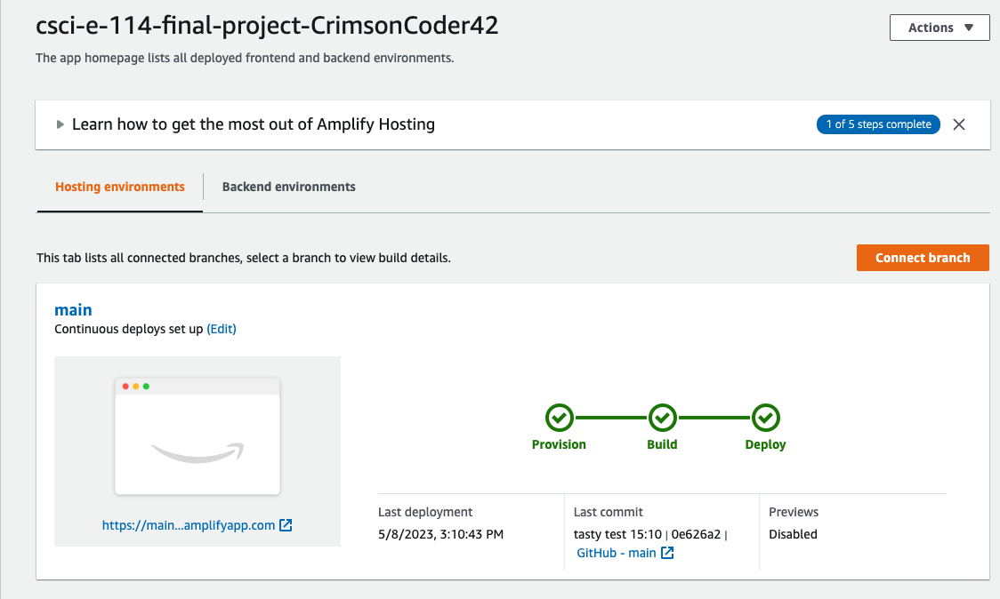

# final-project

**_Any changes to this repo will not update in CI/CD. Not that I don't trust anyone from Harvard, but any account that has my credit card on file will be given access to update the code to that account._**

Final Project

# My Vision

I am an avid outdoorsman and bushcrafter. Two years ago, in the middle of the pandemic, I did the Colorado Trail. I am currently training for the PCT this summer and usually go out for a week at a time with basically a pack and what I can carry.

This project will be an evolution of past projects to give me what I need when I'm on the trail. Step one will be the standard finding and listing from NPS. In this project, however, I have combined it with the national weather service so I can get the weather for any park. Then submitting my name, email, and number will give me both email and text for severe weather alerts. I have found this to be very much needed on remote trails. Sometimes you will get a signal but not enough for data but enough for a text message. Then sometimes you will get a wifi signal but no text messaging ability.

# Project Requirements

To meet the project requirements, please ensure the following:

1. **Static Site Generator**: Make sure that the pages in your project are built using a Static Site Generator. Next.js already supports static site generation, and the current code utilizes the `getStaticProps` and `getStaticPaths` functions to pre-render pages at build time. The project meets this requirement.

2. **Data-Driven Content**: Your project should utilize data to drive the content. Currently fetching data from the National Park Service API and the Weather API, which fulfills this requirement.

3. **Version Control with GitHub**: Create a repository on GitHub and push your project to it. https://github.com/cscie114/csci-e-114-final-project-CrimsonCoder42/tree/main/final_app

4. **CI/CD process that deploys to hosting**: Amplify provides its own hosting steps which I found once connected to a Git repo will block actions from redeploying.
   

# SendGrid Integration

The project uses SendGrid to send email notifications with weather reports. `next_park_weather_proj/pages/api/sendgrid.js`

````javascript
import sendgrid from '@sendgrid/mail';

sendgrid.setApiKey(process.env.SENGRID_PUBLIC_KEY);

async function sendEmail(req, res) {
  try {
    await sendgrid.send({
      to: req.body.to,
      from: 'nostro37@gmail.com',
      subject: 'TrailWeather: Your Park Weather Report',
      html: req.body.message,
    });

    res.status(200).json({
      success: true
    });
  } catch (error) {
    console.error(error);

    res.status(500).json({
      success: false
    });
  }
}

2. **Data-Driven Content**: Your project should utilize data to drive the content. Currently fetching data from the National Park Service API and the Weather API, which fulfills this requirement.

#To get a SendGrid API key SENGRID_PUBLIC_KEY , follow these steps:

Visit the SendGrid website: https://sendgrid.com/ and sign in to your account. If you don't have an account, sign up for one. SendGrid offers a free tier with limited email sending capabilities that may be suitable for your needs.

After signing up and logging in, complete the required steps account setup, including email verification and two-factor authentication if prompted.

Once you are logged in and your account is set up, navigate to the SendGrid dashboard.

In the left sidebar, click on "Settings" and then "API Keys."

Click on the "Create API Key" button in the top-right corner of the API Keys page.

A pop-up window will appear asking you to enter a name for your API key and to select the level of access you want to grant the key. Choose the appropriate access level according to your needs. For most cases, "Full Access" or "Restricted Access" with the necessary permissions should suffice.

Click on "Create & View" to generate the API key.

Your new SendGrid API key will be displayed on the screen. Make sure to copy and save it in a secure location, as it will not be shown again. If you lose the API key, you will need to create a new one.

# Deploying to Vercel

The Next.js project can also be easily deployed to Vercel, which offers seamless integration with Next.js and costs much less if you forget you kept it running. Visit the deployed project at: [https://csci-e-114-final-project-crimson-coder42.vercel.app/](https://csci-e-114-final-project-crimson-coder42.vercel.app/)

To deploy your project to Vercel, follow these steps:

1. Sign up for a Vercel account and log in.
2. Connect your GitHub account to Vercel.
3. Import your GitHub repository with the Next.js project.
4. Configure the environment variables, if needed.
5. Deploy your project.

Vercel will automatically build and deploy your Next.js project. It is similar to how Netlify makes it easy for Gatsby projects.

# How to Run the Project

Follow these steps to set up and run the project locally on your machine:

## Prerequisites

Ensure that you have the following installed on your system:

1. Node.js[^1^]
2. npm[^2^]
3. Git[^3^]

[^1^]: [https://nodejs.org/en/download/](https://nodejs.org/en/download/)
[^2^]: [https://www.npmjs.com/get-npm](https://www.npmjs.com/get-npm)
[^3^]: [https://git-scm.com/downloads](https://git-scm.com/downloads)

## Clone the Repository

```shell
git clone https://github.com/cscie114/csci-e-114-final-project-CrimsonCoder42.git


## Install Dependencies

`cd csci-e-114-final-project-CrimsonCoder42/final_app/next_park_weather_proj`
`npm ci`

## Create `.env.local` File

Replace `<your_nps_api_key>` with your actual API key.

## Run the Development Server

Open your browser and visit `http://localhost:3000` to access the application.

## Build and Run the Production Version

`npm run build`
`npm run start`

This will build and serve the production version of the application at `http://localhost:3000`.
````
